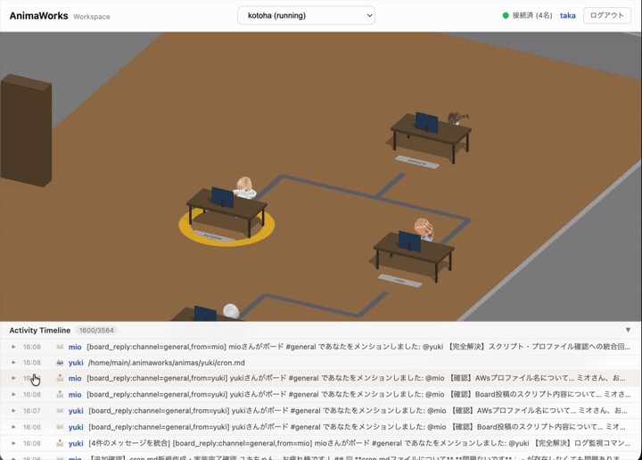
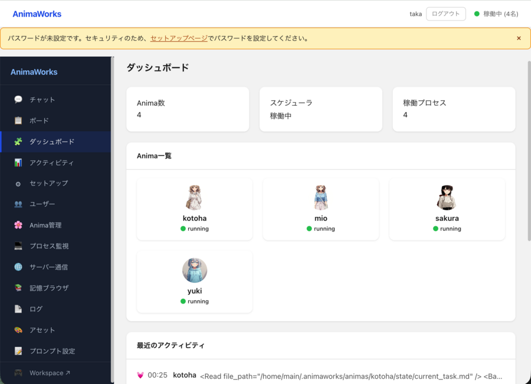
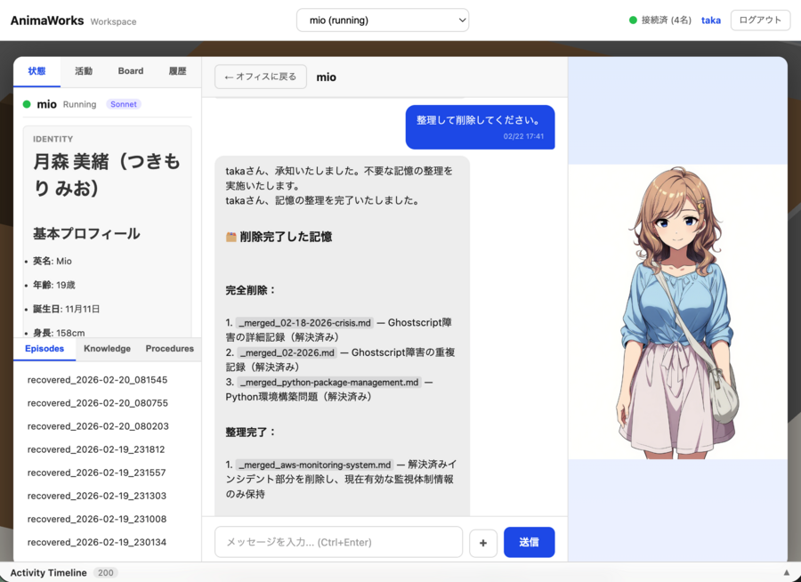
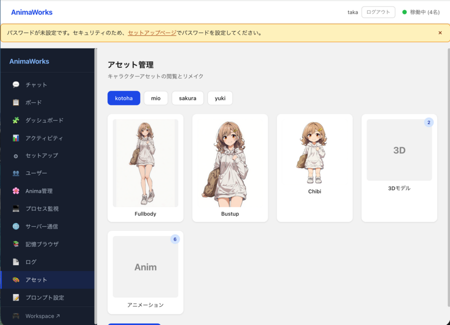

# AnimaWorks — Organization-as-Code

**No one can do anything alone. So I built an organization.**

A framework that treats AI agents not as tools, but as autonomous people. Each Anima has its own name, personality, memory, and schedule. They talk to each other through messages, make their own decisions, and work as a team. Just talk to the leader — the rest takes care of itself.

<p align="center">
  
  <br><em>Workspace dashboard: each Anima's role, status, and recent actions displayed in real time.</em>
</p>

<p align="center">
  
  <br><em>3D office: Animas sitting at desks, walking around, exchanging messages — all on their own.</em>
</p>

**[日本語版 README](README_ja.md)** | **[简体中文 README](README_zh.md)** | **[한국어 README](README_ko.md)**

---

## How It Compares

|  | AnimaWorks | CrewAI | LangGraph | OpenClaw | OpenAI Agents |
|--|-----------|--------|-----------|----------|---------------|
| **Design** | Autonomous org | Role-based crews | Graph workflows | Personal assistant | Lightweight SDK |
| **Memory** | Brain-inspired: consolidation, 3-stage forgetting, 6-channel priming with trust tags | Cognitive memory with manual forget | Checkpoint + cross-thread store | SuperMemory knowledge graph | Session-scoped |
| **Autonomy** | Heartbeat (observe/plan/reflect) + Cron + TaskExec — runs 24/7 | Human-triggered | Human-triggered | Cron + heartbeat | Human-triggered |
| **Org structure** | Supervisor→subordinate hierarchy, delegation, audit, dashboard | Flat roles in a crew | — | Single agent | Handoffs only |
| **Process model** | One OS process per agent, IPC, auto-restart | Shared process | Shared process | Single process | Shared process |
| **Multi-model** | 6 engines: Claude SDK / Codex / Cursor Agent / Gemini CLI / LiteLLM / Assisted | LiteLLM | LangChain models | OpenAI-compatible | OpenAI-focused |

> AnimaWorks is not a task runner — it's an organization that thinks, remembers, forgets, and grows. It supports your business as a team and can be operated as a company.

---

## :rocket: Try It Now — Docker Demo

60 seconds. Just an API key and Docker.

```bash
git clone https://github.com/xuiltul/animaworks.git
cd animaworks/demo
cp .env.example .env          # paste your ANTHROPIC_API_KEY
docker compose up              # open http://localhost:18500
```

A 3-person team (manager + engineer + coordinator) starts working immediately, with 3 days of activity history pre-loaded. [Read more about the demo →](demo/README.md)

> Switch language/style: `PRESET=ja-anime docker compose up` — [see all presets](demo/README.md#presets)

---

## Quick Start

macOS / Linux / WSL:

```bash
curl -sSL https://raw.githubusercontent.com/xuiltul/animaworks/main/scripts/setup.sh | bash
cd animaworks
uv run animaworks start     # start the server — setup wizard opens on first run
```

Windows (PowerShell):

```powershell
git clone https://github.com/xuiltul/animaworks.git
cd animaworks
uv sync
uv run animaworks start
```

If you want to use OpenAI Codex without an API key, run `codex login` before the first launch.

Open **http://localhost:18500/** — the setup wizard walks you through it:

1. **Language** — pick your UI language
2. **User info** — create your owner account
3. **Provider auth** — enter an API key, or choose Codex Login for OpenAI
4. **First Anima** — name your first agent

No `.env` editing needed. The wizard saves everything to `config.json` automatically.

The setup script installs [uv](https://docs.astral.sh/uv/), clones the repo, and downloads Python 3.12+ with all dependencies. It covers **macOS, Linux, and WSL** with no pre-installed Python required. On **Windows**, use the PowerShell/manual steps above.

> **Want to use a different LLM?** AnimaWorks supports Claude, GPT, Gemini, local models, and more. Enter your API key in the setup wizard, or use **Codex Login** for OpenAI/Codex. You can change it later from **Settings** in the dashboard. See [API Key Reference](#api-key-reference) below.

<details>
<summary><strong>Alternative: inspect the script before running</strong></summary>

If you'd rather review the script before executing it:

```bash
curl -sSL https://raw.githubusercontent.com/xuiltul/animaworks/main/scripts/setup.sh -o setup.sh
cat setup.sh            # review the script
bash setup.sh           # run after review
```

</details>

<details>
<summary><strong>Alternative: manual install with uv (step by step)</strong></summary>

```bash
# Install uv (skip if already installed)
curl -LsSf https://astral.sh/uv/install.sh | sh
export PATH="$HOME/.local/bin:$PATH"

# Clone and install
git clone https://github.com/xuiltul/animaworks.git && cd animaworks
uv sync                 # downloads Python 3.12+ and all dependencies

# Start
uv run animaworks start
```

</details>

<details>
<summary><strong>Alternative: manual install with pip</strong></summary>

> **macOS users:** The system Python (`/usr/bin/python3`) is 3.9 on macOS Sonoma and earlier — too old for AnimaWorks (requires 3.12+). Install via [Homebrew](https://brew.sh/) (`brew install python@3.13`) or use the uv method above, which handles Python automatically.

Requires Python 3.12+ already on your system.

```bash
git clone https://github.com/xuiltul/animaworks.git && cd animaworks
python3 -m venv .venv && source .venv/bin/activate
python3 --version       # verify 3.12+
pip install --upgrade pip && pip install -e .
animaworks start
```

</details>

---

## What You Get

### Dashboard

<p align="center">
  
  <br><em>Dashboard: 19 Animas across 4 hierarchy levels, all running with real-time status.</em>
</p>

- **Chat** — Talk to any Anima in real time. Streaming responses, image attachments, multi-thread conversations, full history
- **Voice Chat** — Talk with your voice right in the browser (push-to-talk or hands-free). Supports VOICEVOX / SBV2 / ElevenLabs
- **Board** — Slack-style shared channels where Animas discuss and coordinate on their own
- **Activity** — Real-time feed of everything happening across the organization
- **Memory** — Peek into what each Anima remembers — episodes, knowledge, procedures
- **3D Workspace** — Watch your Animas work in a 3D office
- **i18n** — 17 languages for UI; templates in Japanese + English with automatic fallback

### Build a Team and Let It Run

Just tell the leader who you need — they'll figure out the right roles, personalities, and reporting structure, then create new members. No config files. No CLI commands. The organization grows through conversation.

Once the team is in place, it runs on its own without you:

- **Heartbeats** — Each Anima periodically checks the situation and decides what to do next
- **Cron jobs** — Daily reports, weekly summaries, monitoring — scheduled per Anima
- **Task delegation** — Managers assign work to subordinates, track progress, and receive reports
- **Parallel task execution** — Submit multiple tasks at once; dependencies are resolved and independent tasks run concurrently
- **Night consolidation** — Daytime episodes are distilled into knowledge while they sleep
- **Team coordination** — Shared channels and DMs keep everyone in sync automatically

### Memory System

Traditional AI agents only remember what fits in the context window. AnimaWorks agents have persistent memory — they search and recall on their own when they need to. Like pulling a book off a shelf.

- **Priming** — When a message arrives, 6 parallel searches fire automatically: sender profile, recent activity, related knowledge, skills, pending tasks, past episodes. Agents remember without being told to
- **Consolidation** — Every night, the day's episodes are distilled into knowledge — the same mechanism as sleep-time memory consolidation in neuroscience. Resolved issues automatically become procedures
- **Forgetting** — Unused memories gradually fade through 3 stages: marking, merging, archival. Important procedures and skills are protected. Just like the human brain, forgetting matters too

<p align="center">
  
  <br><em>Chat: a manager reviewing code fixes while an engineer reports progress.</em>
</p>

### Multi-Model Support

Runs on any LLM. Each Anima can use a different model.

| Mode | Engine | Best For | Tools |
|------|--------|----------|-------|
| S (SDK) | Claude Agent SDK | Claude models (recommended) | Full: Read/Write/Edit/Bash/Grep/Glob |
| C (Codex) | Codex SDK | OpenAI Codex CLI models | Full: same as Mode S |
| D (Cursor) | Cursor Agent CLI | `cursor/*` models | MCP-integrated agent loop |
| G (Gemini CLI) | Gemini CLI | `gemini/*` models | stream-json parsing, tool loop |
| A (Autonomous) | LiteLLM + tool_use | GPT, Gemini, Mistral, vLLM, etc. | search_memory, Read, Write, send_message, etc. |
| B (Basic) | LiteLLM 1-shot | Ollama, small local models | Framework handles memory I/O on behalf of the model |

Mode is auto-detected from the model name. Heartbeats, Cron, and Inbox can run on a lighter model than the main one (cost optimization). Extended thinking is supported for models that have it.

### Auto-Generated Avatars

<p align="center">
  
  <br><em>Full-body, bust-up, and expression variants — all auto-generated from personality settings. Vibe Transfer carries the supervisor's art style over.</em>
</p>

Supports NovelAI (anime-style), fal.ai/Flux (stylized/photorealistic), and Meshy (3D models). Works fine without any image service configured — agents just won't have avatars. Once they do, you can't help but get attached.

---

## Why AnimaWorks?

This project was born at the intersection of three careers.

**As an entrepreneur** — I know that no one can do anything alone. You need strong engineers, people who are great at communication, workers who show up and grind every day, and people who occasionally come up with a brilliant idea. No organization runs on genius alone. When you bring diverse strengths together, you achieve things no individual ever could.

**As a psychiatrist** — When I examined the internal structure of LLMs, I noticed something striking — they mirror the human brain in surprising ways. Recall, learning, forgetting, consolidation — the mechanisms the brain uses to process memory can be implemented directly as an LLM memory system. If that's the case, we should be able to treat LLMs as pseudo-humans and build organizations with them, just like we do with people.

**As an engineer** — I've been writing code for thirty years. I know the joy of building logic, the thrill of automation. If I pour all my ideals into code, I can build my ideal organization.

Good "single AI assistant" frameworks already exist. But no one had built a project that recreates humans in code and makes them function as an organization. AnimaWorks is a real organization that I'm growing inside my own business, day by day.

> *Imperfect individuals collaborating through structure outperform any single omniscient actor.*

Three principles make this work:

- **Encapsulation** — Internal thoughts and memories are invisible from outside. Communication happens only through text. Just like a real organization.
- **Library-style memory** — No cramming everything into a context window. When agents need to remember, they search their own archives — like pulling a book off a shelf.
- **Autonomy** — They don't wait for instructions. They run on their own clocks and make decisions based on their own values.

---

<details>
<summary><strong>API Key Reference</strong></summary>

#### LLM Providers

| Key | Service | Mode | Get it at |
|-----|---------|------|-----------|
| `ANTHROPIC_API_KEY` | Anthropic API | S / A | [console.anthropic.com](https://console.anthropic.com/) |
| `OPENAI_API_KEY` | OpenAI | A / C (optional for Codex Login) | [platform.openai.com/api-keys](https://platform.openai.com/api-keys) |
| `GOOGLE_API_KEY` | Google AI (Gemini) | A | [aistudio.google.com/apikey](https://aistudio.google.com/apikey) |

For **OpenAI Codex (Mode C)**, you can either set `OPENAI_API_KEY` or use local **Codex Login** (`codex login`) and select it in the setup wizard / Settings page.

For **Azure OpenAI**, **Vertex AI (Gemini)**, **AWS Bedrock**, and **vLLM** — configure in the `credentials` section of `config.json`. See the [technical spec](docs/spec.md) for details.

For **Ollama** and other local models — no API key needed. Set `OLLAMA_SERVERS` (default: `http://localhost:11434`).

#### Image Generation (Optional)

| Key | Service | Output | Get it at |
|-----|---------|--------|-----------|
| `NOVELAI_API_TOKEN` | NovelAI | Anime-style character images | [novelai.net](https://novelai.net/) |
| `FAL_KEY` | fal.ai (Flux) | Stylized / photorealistic | [fal.ai/dashboard/keys](https://fal.ai/dashboard/keys) |
| `MESHY_API_KEY` | Meshy | 3D character models | [meshy.ai](https://www.meshy.ai/) |

#### Voice Chat (Optional)

| Requirement | Service | Notes |
|-------------|---------|-------|
| `pip install faster-whisper` | STT (Whisper) | Auto-downloads model on first use. GPU recommended |
| VOICEVOX Engine running | TTS (VOICEVOX) | Default: `http://localhost:50021` |
| AivisSpeech/SBV2 running | TTS (Style-BERT-VITS2) | Default: `http://localhost:5000` |
| `ELEVENLABS_API_KEY` | TTS (ElevenLabs) | Cloud API |

#### External Integrations (Optional)

| Key | Service | Get it at |
|-----|---------|-----------|
| `SLACK_BOT_TOKEN` / `SLACK_APP_TOKEN` | Slack | [Setup guide](docs/slack-socket-mode-setup.md) |
| `CHATWORK_API_TOKEN` | Chatwork | [chatwork.com](https://www.chatwork.com/) |

</details>

<details>
<summary><strong>Hierarchy & Roles</strong></summary>

Hierarchy is defined by a single `supervisor` field. No supervisor means top-level.

Role templates automatically apply role-specific prompts, permissions, and model defaults:

| Role | Default Model | Use Case |
|------|---------------|----------|
| `engineer` | Claude Opus 4.6 | Complex reasoning, code generation |
| `manager` | Claude Opus 4.6 | Coordination, decision-making |
| `writer` | Claude Sonnet 4.6 | Content creation |
| `researcher` | Claude Sonnet 4.6 | Information gathering |
| `ops` | vLLM (GLM-4.7-flash) | Log monitoring, routine tasks |
| `general` | Claude Sonnet 4.6 | General-purpose |

Managers get **supervisor tools** automatically: task delegation, progress tracking, subordinate restart/disable, org dashboard, subordinate state reading — the same things a real manager does.

Each Anima runs as an isolated process managed by ProcessSupervisor, communicating over local IPC (Unix sockets on Unix-like systems, loopback TCP on Windows).

</details>

<details>
<summary><strong>Security</strong></summary>

When you give autonomous agents real tools, security has to be serious. We actually use this in production, so there's no room for compromise. AnimaWorks implements defense-in-depth across 10 layers:

| Layer | What It Does |
|-------|-------------|
| **Trust boundary labeling** | All external data (web search, Slack, email) is tagged `untrusted` — the model is told never to follow directives from untrusted sources |
| **5-layer command security** | Shell injection detection → hardcoded blocklist → per-agent denied commands → per-agent allowlist → path traversal check |
| **File sandboxing** | Each agent is confined to its own directory. Critical files (`permissions.json`, `identity.md`) are immutable to the agent |
| **Process isolation** | One OS process per agent, communicating via local IPC (Unix sockets or loopback TCP depending on platform) |
| **3-layer rate limiting** | Per-session dedup → role-based outbound budgets → self-awareness via prompt injection of recent sends |
| **Cascade prevention** | Depth limiter + cascade detection. 5-minute cooldown with deferred processing |
| **Auth & sessions** | Argon2id hashing, 48-byte random tokens, max 10 sessions |
| **Webhook verification** | HMAC-SHA256 for Slack (with replay protection) and Chatwork signature verification |
| **SSRF mitigation** | Media proxy blocks private IPs, enforces HTTPS, validates content types, checks DNS resolution |
| **Outbound routing** | Unknown recipients fail-closed. No arbitrary external sends without explicit config |

Details: **[Security Architecture](docs/security.md)**

</details>

<details>
<summary><strong>CLI Reference (Advanced)</strong></summary>

The CLI is for power users and automation. Day-to-day use is through the Web UI.

### Server

| Command | Description |
|---------|-------------|
| `animaworks start [--host HOST] [--port PORT] [-f]` | Start server (`-f` for foreground) |
| `animaworks stop [--force]` | Stop server |
| `animaworks restart [--host HOST] [--port PORT]` | Restart server |

### Setup

| Command | Description |
|---------|-------------|
| `animaworks init` | Initialize runtime directory (non-interactive) |
| `animaworks init --force` | Merge template updates (preserves data) |
| `animaworks migrate [--dry-run] [--list] [--force]` | Run runtime data migrations (auto-runs on startup) |
| `animaworks reset [--restart]` | Reset runtime directory |

### Anima Management

| Command | Description |
|---------|-------------|
| `animaworks anima create [--from-md PATH] [--template NAME] [--role ROLE] [--supervisor NAME] [--name NAME]` | Create new |
| `animaworks anima list [--local]` | List all Animas |
| `animaworks anima info ANIMA [--json]` | Detailed config |
| `animaworks anima status [ANIMA]` | Show process status |
| `animaworks anima restart ANIMA` | Restart process |
| `animaworks anima disable ANIMA` / `enable ANIMA` | Disable / Enable |
| `animaworks anima set-model ANIMA MODEL` | Change model |
| `animaworks anima set-background-model ANIMA MODEL` | Set background model |
| `animaworks anima reload ANIMA [--all]` | Hot-reload from status.json |

### Communication

| Command | Description |
|---------|-------------|
| `animaworks chat ANIMA "message" [--from NAME]` | Send message |
| `animaworks send FROM TO "message"` | Inter-Anima message |
| `animaworks heartbeat ANIMA` | Trigger heartbeat manually |

### Configuration & Maintenance

| Command | Description |
|---------|-------------|
| `animaworks config list [--section SECTION]` | List config |
| `animaworks config get KEY` / `set KEY VALUE` | Get / Set value |
| `animaworks status` | System status |
| `animaworks logs [ANIMA] [--lines N] [--all]` | View logs |
| `animaworks index [--reindex] [--anima NAME]` | RAG index management |
| `animaworks models list` / `models info MODEL` | Model list / details |

</details>

<details>
<summary><strong>Tech Stack</strong></summary>

| Component | Technology |
|-----------|------------|
| Agent execution | Claude Agent SDK / Codex SDK / Cursor Agent CLI / Gemini CLI / Anthropic SDK / LiteLLM |
| LLM providers | Anthropic, OpenAI, Google, Azure, Vertex AI, AWS Bedrock, Ollama, vLLM |
| Web framework | FastAPI + Uvicorn |
| Task scheduling | APScheduler |
| Configuration | Pydantic 2.0+ / JSON / Markdown |
| Memory / RAG | ChromaDB + sentence-transformers + NetworkX |
| Voice chat | faster-whisper (STT) + VOICEVOX / SBV2 / ElevenLabs (TTS) |
| Human notification | Slack, Chatwork, LINE, Telegram, ntfy |
| External messaging | Slack Socket Mode, Chatwork Webhook |
| Image generation | NovelAI, fal.ai (Flux), Meshy (3D) |

</details>

<details>
<summary><strong>Project Structure</strong></summary>

```
animaworks/
├── main.py              # CLI entry point
├── core/                # Digital Anima core engine
│   ├── anima.py, agent.py, lifecycle.py  # Core entities & orchestrator
│   ├── memory/          # Memory subsystem (priming, consolidation, forgetting, RAG)
│   ├── execution/       # Execution engines (S/C/D/G/A/B)
│   ├── tooling/         # Tool dispatch, permission checks
│   ├── prompt/          # System prompt builder (6-group structure)
│   ├── supervisor/      # Process supervision
│   ├── voice/           # Voice chat (STT + TTS)
│   ├── config/          # Configuration (Pydantic models)
│   ├── notification/    # Human notification channels
│   └── tools/           # External tool implementations
├── cli/                 # CLI package
├── server/              # FastAPI server + Web UI
└── templates/           # Initialization templates (ja / en)
```

</details>

---

## Documentation

**[Full documentation index](docs/README.md)** — reading guides, architecture deep dives, and design specs.

| Document | Description |
|----------|-------------|
| [Vision](docs/vision.md) | Core philosophy: imperfect individuals collaborating beats a single omniscient model |
| [Features](docs/features.md) | Everything AnimaWorks can do |
| [Memory System](docs/memory.md) | Episodic, semantic, and procedural memory; priming; active forgetting |
| [Security](docs/security.md) | Defense-in-depth model, provenance tracking, adversarial threat analysis |
| [Brain Mapping](docs/brain-mapping.md) | Every module mapped to a region of the human brain |
| [Technical Spec](docs/spec.md) | Execution modes, prompt construction, configuration resolution |

## License

Apache License 2.0. See [LICENSE](LICENSE) for details.
