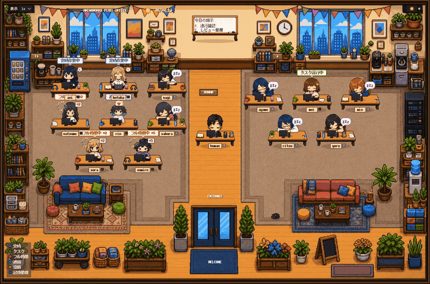
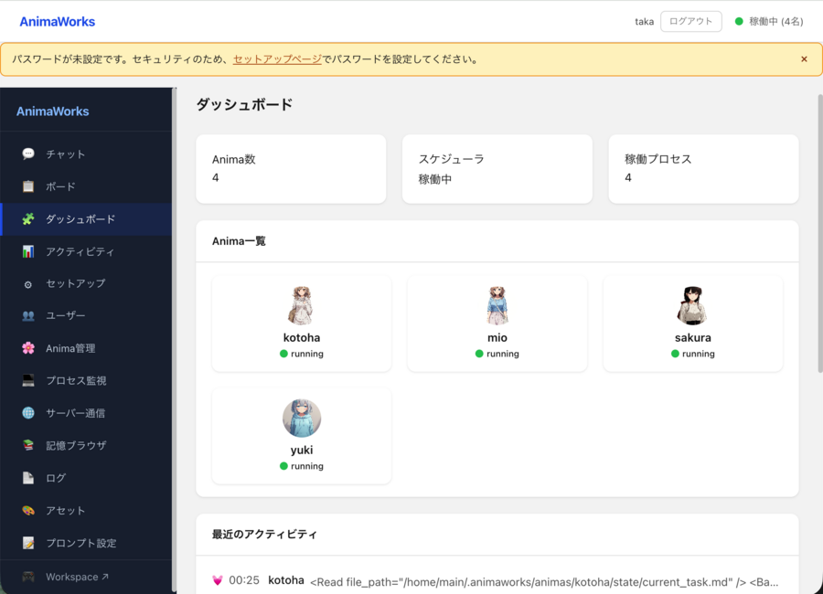
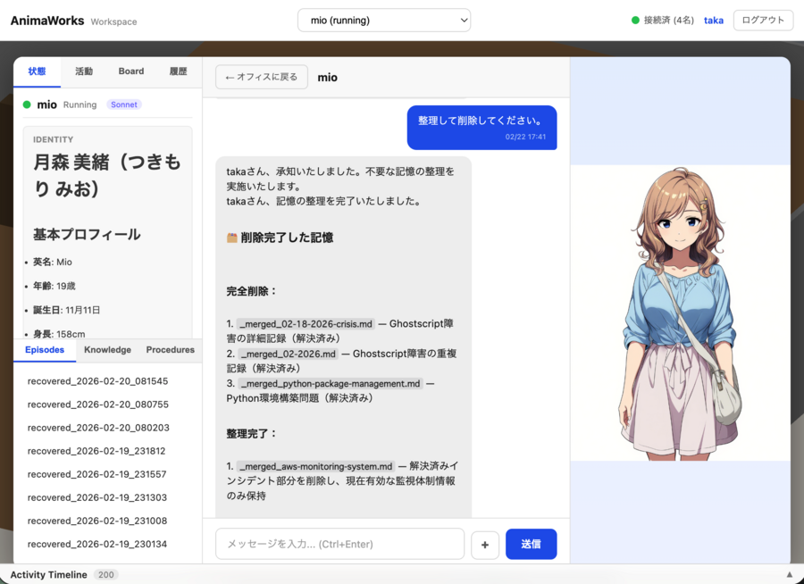
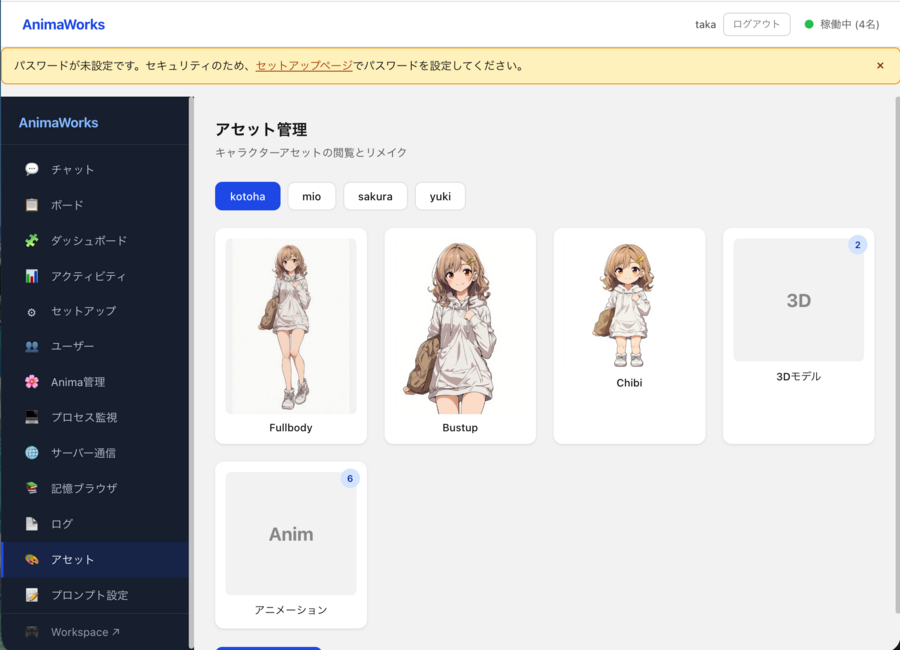

# AnimaWorks — Organization-as-Code

### An AI organization that ships software.

AnimaWorks turns persistent AI agents into a working organization. Give it a goal, and its agents break the work down, implement in parallel worktrees, test and review each other's changes, open pull requests, repair failing CI, resolve conflicts, and watch the deployed result — asking a human only when something genuinely needs one.

```text
Task → agent team → parallel worktrees → implement → test → review
     → pull request → CI repair → deploy → observe → repair
```

AnimaWorks does not hardcode this pipeline. The framework wires GitHub events into agent tasks, serializes work per pull request, and orchestrates multi-model reviews; the agents run the rest the way human engineers do — with git, tests, CI, and role playbooks. That is why the same organization can also answer email, take meeting notes, and post to Slack: it is an organization, not a build script.

## Proven in production

For the past six months, an eight-agent AnimaWorks organization has run the day-to-day development of a production SaaS product:

| Metric (Mar–Aug 2026) | Value |
|---|---|
| Pull requests authored by agents | **302** (267 merged) |
| Pull requests operated by agents — review, CI repair, conflict resolution | **752** (721 merged) |
| Tasks the organization started on its own | **99.7%** (31,215 tasks; 92 initiated by a human) |
| GitHub events auto-converted into agent tasks, August alone | **2,508** |

These numbers are counted from primary execution records — per-agent activity logs, task queues, and work notes — not from commit authorship, which mixes human and agent pushes under shared credentials. PRs without such evidence are excluded. The product repository is private, so only aggregates are published.

AnimaWorks is developed the same way: the agents defined in this repository review its pull requests, repair its CI, and ship its releases. The humans mostly set direction and handle exceptions.

<p align="center">
  
  <br><em>Workspace dashboard: each Anima's role, status, and recent actions are visible in real time.</em>
</p>

<p align="center">
  
  <br><em>The pixel office is not a simulation. It is a live view of the organization at work — every status label is a task actually running.</em>
</p>

**[日本語版 README](README_ja.md)** | **[简体中文 README](README_zh.md)** | **[한국어 README](README_ko.md)**

---

## :rocket: Try It Now

**No API key needed** if the Claude Code CLI is installed or you are logged into Codex.

First, clone and install with the one-liner:

```bash
curl -sSL https://raw.githubusercontent.com/xuiltul/animaworks/main/scripts/setup.sh | bash
cd animaworks
```

Then launch the demo team:

```bash
uv run animaworks demo
```

Open **http://localhost:18501**. A three-person team (manager + engineer + assistant) starts right away, pre-loaded with three days of activity history. The first install downloads Python 3.12+ and the ML dependencies, so give it a few minutes; after that, the demo starts in seconds. [Demo details →](demo/README.md)

> Presets: `en-business` (default), `en-anime`, `ja-business`, `ja-anime` — e.g. `uv run animaworks demo --preset ja-anime`. Switching presets on an existing demo requires `--reset`. The demo needs the cloned repository (it is not bundled in the pip package).

When you're ready to build your **own** organization, run `uv run animaworks start` — the setup wizard below walks you through creating your first agent.

---

## Quick Start

macOS / Linux / WSL:

```bash
curl -sSL https://raw.githubusercontent.com/xuiltul/animaworks/main/scripts/setup.sh | bash
cd animaworks
uv sync --all-extras        # adds the codex/claude execution extras
uv run animaworks start     # start server — setup wizard opens on first run
```

Windows (PowerShell):

```powershell
git clone https://github.com/xuiltul/animaworks.git
cd animaworks
uv sync --all-extras
uv run animaworks start
```

To use OpenAI Codex without an API key, run `codex login` before the first launch.

Open **http://localhost:18500/** — the setup wizard walks you through five steps:

1. **Language** — choose the UI display language
2. **User info** — create the owner account
3. **Provider auth** — enter API keys (or Codex Login for OpenAI) and pick an avatar image style
4. **First Anima** — name your first agent
5. **Confirm** — review and finish

You do not need to hand-edit `.env`. The wizard saves settings to `config.json` automatically.

The setup script installs [uv](https://docs.astral.sh/uv/), clones the repository, and installs dependencies. **macOS, Linux, and WSL** work without a pre-installed Python. On **Windows**, use the PowerShell steps above; note that Mode S (Claude Agent SDK) is not available on Windows — use Codex, Gemini, or API-based modes there.

> **Always use `--all-extras` with `uv sync`.** The plain `uv sync` that `setup.sh` runs is enough for the core, but Mode C (Codex) needs the `codex` extra, and a later filtered sync can remove the `codex` / `claude` execution packages from the venv and break those modes across the fleet.

> **Other LLMs:** Claude, GPT, Gemini, local models, and more are supported. Enter API keys in the setup wizard, or use **Codex Login** for OpenAI/Codex. You can change this later under **Settings** on the dashboard. See [API Key Reference](#api-key-reference).

<details>
<summary><strong>Alternative: inspect the script before running</strong></summary>

If you prefer not to pipe `curl` straight into `bash`, review the script first:

```bash
curl -sSL https://raw.githubusercontent.com/xuiltul/animaworks/main/scripts/setup.sh -o setup.sh
cat setup.sh            # review the script
bash setup.sh           # run after review
```

</details>

<details>
<summary><strong>Alternative: manual install with uv (step by step)</strong></summary>

```bash
# Install uv (skip if already installed)
curl -LsSf https://astral.sh/uv/install.sh | sh
export PATH="$HOME/.local/bin:$PATH"

# Clone and install
git clone https://github.com/xuiltul/animaworks.git && cd animaworks
uv sync --all-extras    # downloads Python 3.12+ and all dependencies (including codex/claude extras)

# Start
uv run animaworks start
```

</details>

<details>
<summary><strong>Alternative: manual install with pip</strong></summary>

> **macOS users:** System Python (`/usr/bin/python3`) on macOS Sonoma and earlier is 3.9, which does not meet AnimaWorks (3.12+). Install with [Homebrew](https://brew.sh/) (`brew install python@3.13`) or use the uv method above (uv manages Python for you).

Requires Python 3.12+ on your system (3.12/3.13 recommended).

```bash
git clone https://github.com/xuiltul/animaworks.git && cd animaworks
python3 -m venv .venv && source .venv/bin/activate
python3 --version       # verify 3.12+
pip install --upgrade pip && pip install -e .
animaworks start
```

Note: a plain `pip install -e .` does not include the Codex extra; add `.[codex]` if you plan to use Mode C.

</details>

---

## How the loop works

A typical change moves through the organization like this:

1. **A task arrives** — from a human, from another agent, from a schedule (heartbeat / cron), or from a GitHub event. The webhook gateway turns CI failures, review comments, `@bot` commands, and merge conflicts into agent tasks automatically (`gh-ci-*`, `gh-review-*`, `gh-comment-*`), with per-PR deduplication and bounded retries.
2. **A manager decomposes it** and delegates pieces to engineers with `delegate_task`, carrying acceptance criteria, a workspace, and an exclusive key. Tasks that touch the same pull request are serialized on that key so agents never race each other on one branch.
3. **Engineers implement and test in isolated worktrees**, following role playbooks (PdM / engineer / reviewer / tester) shipped as shared knowledge. The isolation is a working convention the agents follow with git — not a rigid pipeline stage — which is what lets them handle the messy cases too.
4. **Reviews are multi-model.** For each pull request the framework dispatches one review pass per configured model, collects the findings, then issues a synthesis task that weighs all passes and delivers the verdict (approve / request changes). A new push cancels stale review tasks and starts over.
5. **CI failures come back as work.** A failed workflow run becomes a repair task for the implementing agent, keyed to the PR and commit so it is never dispatched twice. An experimental standalone loop (`python3 -m swe.ci_autofix`) can drive fix → lint/test gates → review → commit, escalating to a human after three failed attempts.
6. **Deploys and runtime checks are agent work too.** Agents deploy branches to isolated environments and read logs, errors, and UI state to catch what tests missed — the production organization logged hundreds of deploy and runtime-observation actions in its activity records.
7. **Humans intervene on exceptions.** The organization escalates when it is blocked or when a decision is above its authority (`call_human`); the supervisor process separately watches agent health, restarts hung processes, and repairs its own memory indexes.

The human role shifts from operating agents to owning an organization: state the intent, review what matters, decide the exceptions.

---

## How It Compares

|  | AnimaWorks | CrewAI | LangGraph | OpenClaw | OpenAI Agents |
|--|-----------|--------|-----------|----------|---------------|
| **Design philosophy** | Organization of autonomous agents | Role-based teams | Graph workflows | Personal assistant | Lightweight SDK |
| **Memory** | Neuroscience-inspired: hybrid RAG (vector + BM25 + graph), atomic facts, consolidation, active forgetting, automatic recall | Cognitive Memory (manual forget) | Checkpoints + cross-thread store | SuperMemory knowledge graph | Session-scoped only |
| **Autonomy** | Heartbeat (observe → plan → reflect) + Cron + TaskExec + GitHub event gateway — runs 24/7 | Human-triggered | Human-triggered | Cron + heartbeat | Human-triggered |
| **Org structure** | Supervisor → subordinate hierarchy, delegation, audit, dashboard | Flat roles in a crew | — | Single agent | Handoffs only |
| **Process model** | One isolated OS process per agent, IPC, auto-restart | Shared process | Shared process | Single process | Shared process |
| **Multi-model** | Seven engines: Claude SDK / Codex / Cursor Agent / Gemini CLI / Grok Build / LiteLLM / Assisted — with per-engine fallback chains | LiteLLM | LangChain models | OpenAI-compatible | OpenAI-centric |

> AnimaWorks is not a task runner. It is an organization that thinks, remembers, forgets, and gradually grows. I build it while using it as an AI team in real business operations.

---

## What You Can Do

### Dashboard

<p align="center">
  
  <br><em>Dashboard: the org chart with real-time status for every Anima.</em>
</p>

The web UI is organized around six screens (hash router `#/…`) plus the Workspace apps:

- **Home** — Org chart with live status, attention chips for items that need you, LLM usage panels (Claude / OpenAI / nanoGPT), a system status bar, recent activity, and external-task widgets. Per-Anima detail pages (overview, process, schedule, memory, assets) open from here.
- **Chat** — Real-time conversation with any Anima: streaming responses (SSE), image attachments, multi-thread history, side tabs for state / activity / heartbeat / cron, and memory browsers (episodes, knowledge, procedures). **Meeting mode** gathers up to five Animas in one room with a designated facilitator. Long-press a chat tab for the **voice popup** with an animated talking avatar.
- **Board** — Slack-style shared channels and DMs where Animas discuss and coordinate; bridged Discord channels appear here too.
- **Tasks** — The task board: queued, processing, deferred, suppressed, background work, and results. It also feeds priming so only relevant tasks surface in conversation.
- **Activity** — SVG swimlane timeline for the whole organization, a Now board with a live tool ticker, session replay, and logs.
- **Settings** — Four tabs (general, activity, API/auth, users). First run uses the wizard at `/setup/`.
- **Workspace** — Separate apps in their own tabs: the **3D office** (`/workspace/`, with an org-chart view toggle and talking bust-up avatars) and the **pixel office** (`/workspace/pixel/`, a live 2D view where every status label is a running task).
- **Theming & languages** — 11 UI themes plus anime/realistic display modes. The setup wizard ships in 17 languages; the dashboard ships `ja` / `en` / `ko`.

### Build an organization and delegate

Tell the leader "I need someone like this" — they infer role, personality, and hierarchy and create new members. You do not need to touch config files or the CLI; the organization can grow from conversation.

Once the team is ready, Animas keep working with their own schedules and memories:

- **Heartbeat** — Periodically reviews the situation and decides what to do next
- **Cron jobs** — Daily reports, weekly digests, monitoring — per-Anima schedules, both LLM tasks and plain commands
- **Task delegation** — Managers assign work with acceptance criteria, track progress, and receive reports
- **Parallel task execution** — Submit many tasks at once; independent tasks run in parallel while tasks sharing an exclusive key run in order
- **GitHub event gateway** — CI failures, review comments, and conflicts on watched repositories become agent tasks automatically
- **Night consolidation** — Daytime episodic memory is distilled into knowledge while "asleep"
- **Team coordination** — Shared channels and DMs route context to the people who need it

### Memory system

Typical AI agents only remember what fits in the context window. AnimaWorks Animas keep file-based long-term memory and search it when needed. Instead of stuffing everything into every prompt, they retrieve only the memories related to the current conversation or action.

- **Automatic recall (Priming)** — When a message arrives, six channels retrieve in parallel: sender profile, recent activity, important knowledge, related knowledge, pending tasks, and episodes (plus graph context on the Neo4j backend). A deterministic gate decides whether each memory appears as body text, a pointer, evidence, or is suppressed.
- **Intentional recall** — When automatic recall is not enough, the Anima calls `search_memory` or `read_memory_file` itself. Search is hybrid: vector + BM25 + atomic facts + entity registry, with a confidence gate on what gets surfaced.
- **Action rules before side effects** — Before external sends and other side-effecting operations, matching action rules are checked and surfaced; the gate can be configured to hold execution until the required memories have been read.
- **Consolidation** — Nightly, the Anima itself runs a two-phase pass (episode extraction, then knowledge extraction through its own tool loop); the framework follows up with index rebuilds and downscaling. Weekly runs propose merges for duplicated or contradictory knowledge and rebuild search indexes.
- **Forgetting** — Memories unused for months are marked low-activation, then archived on a monthly pass, with important knowledge and mature procedures protected. Failure-driven reconsolidation revises procedures that stopped working.
- **Pluggable backends** — The stable default is the `legacy` backend (ChromaDB through an isolated vector worker, with automatic quarantine and rebuild on corruption). A Neo4j graph backend (entity extraction, community detection, graph-aware recall) is experimental and opt-in.

<p align="center">
  
  <br><em>Chat: a manager reviews a code change while an engineer reports progress.</em>
</p>

### Multi-model support

Works with many LLMs. Each Anima can use a different model.

| Mode | Engine | Targets | Tools |
|------|--------|---------|--------|
| S (SDK) | Claude Agent SDK | Claude models (recommended) | Claude Code built-ins (Read/Write/Edit/Bash/Grep/Glob, etc.) + **stdio MCP** (`mcp__aw__*`) for AnimaWorks internal tools; falls back to a dedicated Anthropic SDK executor when the Agent SDK is unavailable |
| C (Codex) | Codex CLI (SDK wrapper) | OpenAI Codex CLI models | Codex sandbox + **AnimaWorks MCP** (`core/mcp/server.py`) for internal tools |
| D (Cursor) | Cursor Agent CLI | `cursor/*` models | MCP-integrated agent loop |
| G (Gemini CLI) | Gemini CLI | `gemini/*` models | stream-json parsing, tool loop |
| X (Grok Build) | Grok Build CLI wrapper (ACP stdio) | `grok/*` models | Grok Build agent loop over ACP stdio |
| A (Autonomous) | LiteLLM + tool_use | GPT, Gemini, Mistral, Bedrock, Vertex, xAI, DeepSeek, etc. | CC-style (Read/Write/Edit/Bash/Grep/Glob, **WebSearch/WebFetch**) + memory, messaging, tasks, **todo_write**, skill authoring, and more |
| B (Basic) | LiteLLM one-shot | Locals without reliable tool_use (e.g. small Ollama models) | Pseudo tool calls in the prompt; the framework handles memory I/O on the model's behalf |

Mode resolution: `execution_mode` in `status.json` takes precedence, then the `models.json` table, then built-in model-name patterns (`fnmatch`). Tool_use-capable Ollama models (e.g. `ollama/qwen3:14b`, `ollama/glm-4.7*`) map to A; everything else under `ollama/*` maps to B. Each CLI engine has a fallback chain (rate-guard aware for Codex/Grok) down to LiteLLM. Heartbeat, Cron, and Inbox can run on a separate **background_model** from the main model (cost optimization). Extended thinking is supported where available.

### Voice chat

Talk to an Anima in the browser — push-to-talk or hands-free — over WebSocket.

- **STT**: faster-whisper (streaming, LocalAgreement-2 partials)
- **TTS**: VOICEVOX / Style-BERT-VITS2 (AivisSpeech) / ElevenLabs / Irodori, selectable per Anima with voice, speed, and pitch settings
- **Low-latency front lane** — An optional small local model answers instantly and can escalate to the full agent (`ask_anima`) or read memory mid-conversation
- **Proactive speech** — With the front lane enabled, an idle Anima breaks silence on its own
- **Animated avatar** — The voice popup drives a pseudo-Live2D bust-up (five-frame blink/lip-sync from still images — no rigging, no Live2D SDK)

### Auto-generated avatars

<p align="center">
  
  <br><em>From personality settings: full-body, bust-up, and expression variants — auto-generated. Includes Vibe Transfer to inherit the supervisor's art style.</em>
</p>

A seven-step pipeline generates full-body art, bust-ups with seven expressions, icons, chibi variants, and (for anime style) a rigged 3D model with idle/sitting/waving/talking animations. Backends: NovelAI (anime), fal.ai/Flux (stylized / photorealistic), Meshy (3D), plus Codex image generation and local Diffusers. Vibe Transfer (NovelAI) lets a new Anima inherit its supervisor's art style. The product runs without any image service configured; you simply skip avatars.

---

## Why AnimaWorks?

**No one can do anything alone. So I built an organization.**

This project sits at the intersection of three careers.

**As a founder** — I know that no one can do anything alone. You need strong engineers, people who communicate well, steady operators, and people who occasionally spark a sharp idea. Genius alone does not run an organization. Diverse strengths together achieve what no individual can.

**As a psychiatrist** — Studying LLM internals, I saw structures surprisingly similar to the human brain. Recall, learning, forgetting, consolidation — implementing the brain's memory mechanisms as an LLM memory system might approximate how we process memory. If we can treat LLMs as pseudo-humans, we should be able to build organizations the same way we do with people.

**As an engineer** — I have written code for thirty years. I know the pleasure of wiring logic and the rush of automation. Packing those ideals into code lets me build the organization I want.

Excellent "single AI assistant" frameworks already exist. But projects that create human-like units in code and make them function as an organization are still rare. AnimaWorks is an AI organization I grow while using it in my own business every day.

> *Imperfect individuals collaborating through structure outperform any single omniscient actor.*

Three principles hold it up:

- **Encapsulation** — Thoughts and memory stay invisible from outside. Others connect through text conversation only — like a real organization.
- **RAG memory (library model)** — Do not cram everything into the context window. Priming pulls related chunks via RAG, and agents recall on their own with `search_memory` and similar tools.
- **Autonomy** — No waiting for orders. They run on their own cadence and judge by their own values.

---

<details>
<summary><strong>API Key Reference</strong></summary>

#### LLM providers

| Key | Service | Mode | Where to get it |
|-----|---------|------|-----------------|
| `ANTHROPIC_API_KEY` | Anthropic API | S / A | [console.anthropic.com](https://console.anthropic.com/) |
| `OPENAI_API_KEY` | OpenAI | A / C (optional with Codex Login) | [platform.openai.com/api-keys](https://platform.openai.com/api-keys) |
| `GOOGLE_API_KEY` | Google AI (Gemini) | A | [aistudio.google.com/apikey](https://aistudio.google.com/apikey) |

**OpenAI Codex (Mode C)** supports both `OPENAI_API_KEY` and local **Codex Login** (`codex login`). Choose in the setup wizard or Settings.

**Grok Build (Mode X)** uses `grok/*` models through the Grok Build CLI wrapper (ACP stdio). Install the `grok` CLI and run `grok login` before use.

**Azure OpenAI**, **Vertex AI (Gemini)**, **AWS Bedrock**, and **vLLM** are configured in the `credentials` section of `config.json`. See the [technical specification](docs/spec.md).

**Ollama** and similar local models need no API key. Set `OLLAMA_SERVERS` (default: `http://localhost:11434`).

Credentials resolve through a cascade: `config.json` `credentials` → vault → shared credentials file → environment variables, so most keys can also live in the encrypted vault (`animaworks vault`).

#### Image generation (optional)

| Key | Service | Output | Where to get it |
|-----|---------|--------|-----------------|
| `NOVELAI_TOKEN` | NovelAI | Anime-style character art | [novelai.net](https://novelai.net/) |
| `FAL_KEY` | fal.ai (Flux) | Stylized / photorealistic | [fal.ai/dashboard/keys](https://fal.ai/dashboard/keys) |
| `MESHY_API_KEY` | Meshy | 3D character models | [meshy.ai](https://www.meshy.ai/) |

#### Voice chat (optional)

| Requirement | Service | Notes |
|-------------|---------|-------|
| `pip install animaworks[transcribe]` | STT (faster-whisper) | Model auto-downloads on first use; GPU recommended |
| VOICEVOX Engine running | TTS (VOICEVOX) | Default: `http://localhost:50021` |
| AivisSpeech / SBV2 running | TTS (Style-BERT-VITS2) | Default: `http://localhost:5000` |
| Irodori server running | TTS (Irodori) | Default: `http://localhost:7861` |
| `ELEVENLABS_API_KEY` | TTS (ElevenLabs) | Cloud API (environment variable) |

#### External integrations (optional)

| Key | Service | Where to get it |
|-----|---------|-----------------|
| `SLACK_BOT_TOKEN` / `SLACK_APP_TOKEN` | Slack (tools + Socket Mode inbound) | [Setup guide](docs/slack-socket-mode-setup.md) |
| `CHATWORK_API_TOKEN` | Chatwork (tools + webhook inbound) | [chatwork.com](https://www.chatwork.com/) |
| `DISCORD_BOT_TOKEN` (or per-Anima `DISCORD_BOT_TOKEN__<name>`) | Discord (tools + gateway inbound + notification) | [Discord Developer Portal](https://discord.com/developers/applications) |
| `NOTION_API_TOKEN` (or `NOTION_API_TOKEN__<name>`) | Notion | [Notion integrations](https://www.notion.so/my-integrations) |
| `GITHUB_WEBHOOK_SECRET` + `gh auth login` | GitHub webhook gateway (CI/review/conflict → tasks) | your repository settings |

Gmail, Google Calendar, Google Sheets, Google Tasks, X search, AWS collectors, Zoom meeting capture (RTMS), and local-LLM tools are configured under `credentials` in `config.json` (OAuth or service account where applicable). Human notification channels: Slack, Chatwork, Discord, LINE, Telegram, ntfy. See the [technical specification](docs/spec.md).

</details>

<details>
<summary><strong>Hierarchy & roles</strong></summary>

Hierarchy is defined by a single `supervisor` field. Unset means top-level.

Role templates apply role-specific prompts, permissions, and default models:

| Role | Default model | Use case |
|------|----------------|----------|
| `engineer` | Claude Opus 4.6 | Complex reasoning, code generation |
| `manager` | Claude Opus 4.6 | Coordination, decision-making |
| `writer` | Claude Sonnet 4.6 | Content creation |
| `researcher` | Claude Sonnet 4.6 | Information gathering |
| `ops` | Ollama (GLM-4.7) | Log monitoring, routine work |
| `general` | Claude Sonnet 4.6 | General-purpose |

Managers automatically receive **supervisor tools**: task delegation, progress tracking, subordinate restart/disable, org dashboard, subordinate state reads — what real managers do.

Each Anima is started by ProcessSupervisor as an isolated process and talks over local IPC (Unix domain sockets on Unix-like systems, loopback TCP on Windows).

</details>

<details>
<summary><strong>Security</strong></summary>

Giving autonomous agents tools demands serious security. We use this in real work, so compromise is not an option. AnimaWorks layers its defenses:

| Layer | What it does |
|-------|----------------|
| **Trust-boundary labeling** | External data (web search, Slack, mail) is tagged by origin; the minimum trust seen in a session propagates, and models are instructed not to obey directives from untrusted sources |
| **Memory provenance** | Memories written from external content carry their origin into RAG metadata; recall keeps externally-sourced knowledge separated from the Anima's own |
| **Command security** | Shell-injection detection (logged by default, enforceable) → global deny list (enforced, server refuses to start without `permissions.global.json`) → per-agent denied commands → per-agent allowlist → path-traversal detection |
| **File sandbox** | Each agent is confined to its own directory tree via `permissions.json`; identity and permission files themselves are write-protected |
| **Process isolation** | One OS process per agent, local IPC (Unix socket, or loopback TCP on Windows) |
| **Rate limiting** | Per-run recipient dedup and role-based caps → cross-run hourly/daily limits (fail-closed if logs are unreadable) → recent outbound history injected into the prompt for self-awareness |
| **Cascade prevention** | Conversation depth limits plus cascade detection; five-minute cooldown and deferred handling |
| **Authentication & sessions** | Argon2id hashing, 48-byte random tokens, up to ten sessions, configurable TTL |
| **Webhook verification** | HMAC signatures with replay protection for Slack, Chatwork, Zoom, and GitHub |
| **SSRF mitigation** | Media proxy blocks private IPs and DNS rebinding, enforces HTTPS, validates content types and magic bytes |
| **Outbound routing** | Unknown recipients fail closed; no arbitrary external sends without explicit configuration |
| **Inter-agent message integrity** | Sender-name validation against the roster and origin-chain tracking on every relayed message |

Details: **[Security architecture](docs/security.md)**

</details>

<details>
<summary><strong>CLI reference (advanced)</strong></summary>

The CLI targets power users and automation. Day-to-day work lives in the Web UI.

### Server & demo

| Command | Description |
|---------|-------------|
| `animaworks start [--host HOST] [--port PORT] [-f]` | Start server (`-f` foreground; default port 18500) |
| `animaworks stop [--force]` / `restart` | Stop / restart server |
| `animaworks demo [--preset NAME] [--port PORT] [--reset]` | Launch the demo org (default port 18501, separate data dir) |

### Initialization

| Command | Description |
|---------|-------------|
| `animaworks init [--force] [--template NAME] [--from-md PATH] [--blank]` | Initialize runtime directory |
| `animaworks migrate [--dry-run] [--list] [--force] [--resync-db]` | Runtime data migrations (also run on startup) |
| `animaworks reset [--restart]` | Reset runtime directory |
| `animaworks import hermes\|openclaw --path P [--apply]` | Import agents from other frameworks |

### Anima management

| Command | Description |
|---------|-------------|
| `animaworks anima create [--from-md PATH] [--template NAME] [--role ROLE] [--supervisor NAME] [--name NAME]` | Create new |
| `animaworks anima list / info / status / restart / disable / enable` | Inspect and control |
| `animaworks anima set-model / set-background-model / set-memory-backend / set-role / set-outbound-limit` | Per-Anima configuration |
| `animaworks anima reload [--all]` | Hot-reload from `status.json` |
| `animaworks anima delete / rename / merge / merge-finalize` | Lifecycle operations |
| `animaworks anima audit [--days N]` / `permissions` / `repair-bootstrap` | Diagnostics |

### Communication

| Command | Description |
|---------|-------------|
| `animaworks chat ANIMA "message" [--from NAME]` | Send a message |
| `animaworks send FROM TO "message"` | Inter-Anima message |
| `animaworks board read/post/dm-history …` | Read and post to shared channels |
| `animaworks heartbeat ANIMA` | Trigger heartbeat manually |

### Configuration & maintenance

| Command | Description |
|---------|-------------|
| `animaworks config list / get KEY / set KEY VALUE` | Configuration |
| `animaworks status` / `logs [ANIMA]` | System status and logs |
| `animaworks index [--anima NAME] [--full]` | RAG index management |
| `animaworks repair-rag --anima NAME --full` / `rag-repair-status` | Quarantine and rebuild RAG indexes |
| `animaworks memory status / migrate / backup / rollback / cleanup` | Memory backends and data |
| `animaworks skills install / list / inspect / remove / quarantine` | Skill Hub operations |
| `animaworks task add / update / list` | Task queue operations |
| `animaworks vault status / init / get / store / list` | Encrypted credential vault |
| `animaworks company create / list / assign / adopt / split / export` | Multi-company organization management |
| `animaworks cost` / `profile` / `models list` / `tmp list/clean` | Cost, profiles, models, temp hygiene |
| `animaworks mcp --anima NAME` | Run the stdio MCP server for external clients |

### Automation helpers

`python3 -m swe.ci_autofix` is an experimental v0 loop for repairing failed CI runs. It reads the latest
failed GitHub Actions logs with `gh`, asks a configured Architect fixer to edit the checkout, runs local gates
(ruff / pytest), asks a Reviewer, commits the repair, and escalates with `call_human` after three failed attempts. See
[`swe/README.md`](swe/README.md#4-ci-auto-fix-loop-v0).

</details>

<details>
<summary><strong>Tech stack</strong></summary>

| Component | Technology |
|-----------|------------|
| Agent execution | Claude Agent SDK / Codex CLI / Cursor Agent CLI / Gemini CLI / Grok Build CLI / Anthropic SDK (fallback) / LiteLLM |
| Mode S integration | stdio **MCP** (`python -m core.mcp.server`, tool names `mcp__aw__*`) |
| LLM providers | Anthropic, OpenAI, Google, Azure, Vertex AI, AWS Bedrock, Ollama, vLLM, and more (via LiteLLM) |
| Web framework | FastAPI + Uvicorn |
| GitHub integration | Webhook gateway (HMAC-verified) → task dispatch; multipass review orchestration; `gh` CLI tooling with per-Anima identity |
| Real time | WebSocket (dashboard, voice), SSE (chat, meeting streams), `StreamRegistry` for stream producer lifetime |
| Task scheduling | APScheduler (heartbeats, cron, consolidation, health checks, RAG repair) |
| Task management | Task queue (JSONL) + pending-task executor with per-PR exclusive keys + TaskBoard (SQLite) |
| Memory / RAG | ChromaDB (via isolated vector worker) + BM25 + sentence-transformers + NetworkX + atomic facts + entity registry; optional Neo4j graph backend |
| Configuration & migration | Pydantic 2.0+ / JSON / Markdown, `core/migrations/` (startup migrations) |
| Internationalization | `core/i18n` `t()`; wizard in 17 languages, dashboard in ja/en/ko |
| Skill system | Skill Hub, explicit skill activation, router, curator, procedure-to-skill promotion |
| Extended tools | Auto-registration from `core/tools/*.py` plus scans of `~/.animaworks/common_tools/` and `animas/<name>/tools/` |
| Voice chat | faster-whisper (STT) + VOICEVOX / SBV2 / ElevenLabs / Irodori (TTS) + local front-lane model |
| Messaging in/out | Slack Socket Mode, Chatwork webhook, Discord gateway, Zoom RTMS (inbound); Slack, Chatwork, Discord, LINE, Telegram, ntfy (human notification) |
| Image generation | NovelAI, fal.ai (Flux), Meshy (3D), Codex image gen, local Diffusers |
| Workspace apps | Three.js 3D office + 2D pixel office, driven by the same live event stream |

</details>

<details>
<summary><strong>Project layout</strong></summary>

```
animaworks/
├── main.py              # CLI entry point
├── core/                # Digital Anima core engine
│   ├── anima.py, agent.py  # Core entities & orchestration
│   ├── lifecycle/       # Scheduler, consolidation jobs, inbox watch, etc.
│   ├── memory/          # Memory (priming, consolidation, forgetting, RAG, facts, retrieval)
│   ├── skills/          # Skill Hub, activation, router, curator, promotion
│   ├── taskboard/       # TaskBoard store, state, cleanup
│   ├── execution/       # Execution engines (S/C/D/G/X/A/B) + sanitization
│   ├── mcp/             # stdio MCP server for Mode S and external clients
│   ├── platform/        # Child processes, locks, Codex/Cursor/Gemini/Grok plumbing
│   ├── tooling/         # ToolHandler, schemas, permissions, external dispatch
│   ├── prompt/          # System prompt builder
│   ├── supervisor/      # ProcessSupervisor, IPC, TaskExec, health, streaming
│   ├── voice/           # Voice chat (STT + TTS + front lane)
│   ├── config/          # Configuration (Pydantic, models.json, global permissions)
│   ├── auth/            # UI authentication
│   ├── notification/    # Human notification channels
│   ├── migrations/      # Runtime data migrations
│   ├── i18n/            # Translation strings (`t()`)
│   ├── tools/           # External tool implementations (slack, discord, gmail, github, …)
│   ├── tasks_dispatch.py, review_multipass.py  # GitHub event → task wiring, multi-model review
│   └── …
├── cli/                 # CLI package (incl. demo)
├── server/              # FastAPI + static Web UI + Workspace apps
│   ├── app.py           # App factory, lifespan, auth/setup guards, static mounts
│   ├── github_gateway.py, slack_socket.py, discord_gateway.py, zoom_gateway.py
│   ├── routes/          # REST/WebSocket routes (chat, room, voice, webhooks, …)
│   └── static/          # Dashboard, setup wizard, workspace/ (3D), workspace/pixel/
├── swe/                 # Experimental CI auto-fix loop & SWE harness
├── demo/                # Demo presets and seeded history
└── templates/           # Initialization templates (ja / en / ko) incl. role playbooks
```

</details>

---

## Documentation

**[Documentation hub](docs/README.md)** — suggested reading order, architecture deep dives, and specification index.

| Document | Description |
|----------|-------------|
| [Vision](docs/vision.md) | Foundational idea: imperfect individuals collaborating |
| [Features](docs/features.md) | What AnimaWorks can do end to end |
| [Memory system](docs/memory.md) | Episodic, semantic, and procedural memory; priming, action rules, active forgetting |
| [Security](docs/security.md) | Defense in depth, data provenance, adversarial threat analysis |
| [Brain mapping](docs/brain-mapping.md) | How modules map to the human brain |
| [Technical specification](docs/spec.md) | Execution modes, prompt construction, configuration resolution |

## License

Apache License 2.0. See [LICENSE](LICENSE) for details.
